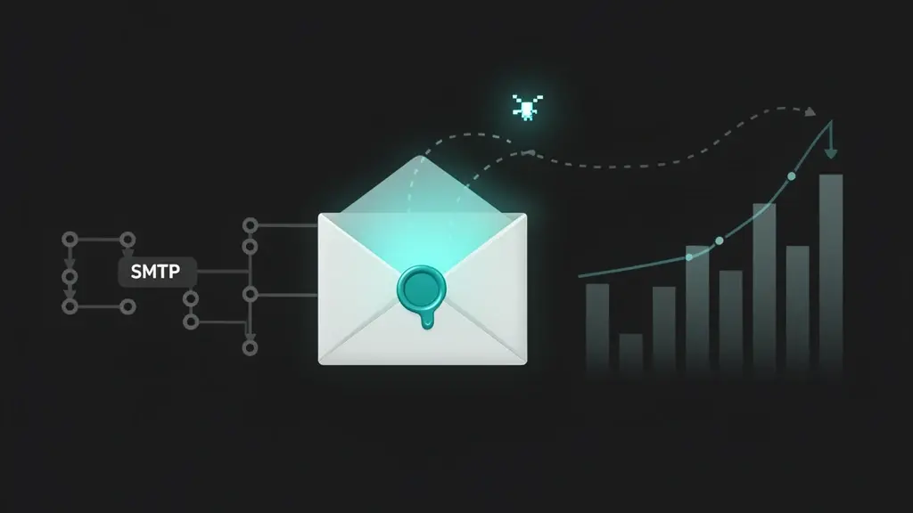

# LibreMailApi - Free email API with SMTP support



> **Fork notice:** This is a fork of [este-linux/libre-mail-api](https://codeberg.org/este-linux/libre-mail-api) originally created by [ILS Este](https://serviziliberi.it) (Italian Linux Society - Este section). We maintain this fork to add features needed for our Ghost newsletter setup (e.g. open tracking via the Mailgun Events API).

A free and open-source email API written in PHP that not only simulates email sending but can also send real emails through configurable SMTP servers. Uses Guzzle HTTP client, PHPMailer and other modern libraries to provide a Mailgun-compatible API.

This idea was born when I had to send newsletters through [Ghost](https://ghost.org) and it required paying for the Mailgun service even though I had a dedicated SMTP server for newsletters.

## Features

- **Compatible API endpoints**: Implements main Mailgun endpoints for email sending
- **Real email sending**: Supports actual email delivery through configurable SMTP servers
- **Open tracking**: Injects a 1×1 tracking pixel per recipient with HMAC-signed tokens; records open events in SQLite and exposes them via a Mailgun-compatible Events API so Ghost can track newsletter opens
- **Events API**: `GET /v3/{domain}/events` with filtering, cursor-based pagination, and Mailgun-compatible response format
- **Dual mode**: Works in both simulation and real sending modes
- **HTTP basic authentication**: Simulates Mailgun API authentication
- **Simulated storage**: Saves messages in JSON files for later retrieval
- **Complete validation**: Validates email addresses, attachments and parameters
- **Advanced logging**: Records both simulated and real SMTP operations
- **Attachment handling**: Supports upload, storage and sending of attachments
- **MIME format**: Supports sending messages in MIME format
- **Flexible SMTP configuration**: Supports various SMTP providers (Gmail, Outlook, custom servers)

## Implemented endpoints

### Message sending
- `POST /v3/{domain}/messages` - Send email with form parameters
- `POST /v3/{domain}/messages.mime` - Send email in MIME format

### Message management
- `GET /v3/domains/{domain}/messages/{storage_key}` - Retrieve saved email
- `GET /v3/domains/{domain}/sending_queues` - Sending queue status
- `DELETE /v3/{domain}/envelopes` - Delete scheduled messages

### Events & analytics
- `GET /v3/{domain}/events` - Fetch events (delivered, opened) with Mailgun-compatible filtering and pagination
- `GET /t/o/{token}` - Tracking pixel endpoint (no auth, serves 1×1 GIF and records open event)

### SMTP management
- `GET /v3/{domain}/smtp` - SMTP configuration status
- `GET /v3/{domain}/smtp/test` - SMTP connection test

## Installation

1. **Clone the repository**:
```bash
git clone <repository-url>
cd libre-mail-api
```

2. **Install dependencies**:
```bash
composer install
```

3. **Start the server**:
```bash
composer start
# or
php -S localhost:8080 index.php
```

## Configuration

### Basic configuration
Configuration is located in `config/config.php`. To get started, copy the example file:

```bash
cp config/config.example.php config/config.php
```

### SMTP configuration
To enable real email sending, modify the `smtp` section in `config/config.php`:

```php
'smtp' => [
    'enabled' => true, // Enable SMTP sending
    'host' => 'smtp.gmail.com', // SMTP server
    'port' => 587, // SMTP port
    'encryption' => 'tls', // Encryption (tls/ssl/null)
    'auth' => true, // SMTP authentication
    'username' => 'your-email@gmail.com', // SMTP username
    'password' => 'your-app-password', // SMTP password
    'from_name' => 'Your Name', // Default sender name
    'from_email' => 'your-email@gmail.com', // Default sender email
]
```

#### SMTP configuration examples

**Gmail (with app password):**
```php
'smtp' => [
    'enabled' => true,
    'host' => 'smtp.gmail.com',
    'port' => 587,
    'encryption' => 'tls',
    'username' => 'your-email@gmail.com',
    'password' => 'your-16-char-app-password', // Not your regular password!
]
```

**Outlook/Hotmail:**
```php
'smtp' => [
    'enabled' => true,
    'host' => 'smtp-mail.outlook.com',
    'port' => 587,
    'encryption' => 'tls',
    'username' => 'your-email@outlook.com',
    'password' => 'your-password',
]
```

**Custom SMTP server:**
```php
'smtp' => [
    'enabled' => true,
    'host' => 'mail.yourdomain.com',
    'port' => 587,
    'encryption' => 'tls',
    'username' => 'noreply@yourdomain.com',
    'password' => 'your-password',
]
```

### Open tracking configuration

Open tracking lets Ghost see newsletter open rates. It works by injecting a tiny invisible image into each email; when the recipient's email client loads the image, an "opened" event is recorded.

Add the `tracking` section to `config/config.php` (or set via environment variables):

```php
'tracking' => [
    'pixel_base_url' => getenv('TRACKING_PIXEL_BASE_URL') ?: 'https://yourdomain.com/t/o',
    'hmac_secret' => getenv('TRACKING_HMAC_SECRET') ?: 'CHANGE_ME_TO_A_RANDOM_SECRET',
],
```

- `pixel_base_url`: The public URL where the tracking pixel is served. Must be reachable from the internet.
- `hmac_secret`: A random secret used to sign tracking tokens (prevents forged open events). Generate one with `openssl rand -hex 32`.

When Ghost sends a newsletter with `o:tracking-opens=true`, LibreMailApi will:

1. Create a per-recipient delivery record in SQLite
2. Inject a `` before `</body>` in the HTML
3. Emit a "delivered" event after successful SMTP relay (250 response)
4. When the pixel is loaded, validate the HMAC and record an "opened" event
5. Serve events via `GET /v3/{domain}/events` in Mailgun format for Ghost to poll

**Note:** "Delivered" events reflect SMTP relay acceptance, not inbox delivery. Downstream bounces are not tracked in this version.

#### Reverse proxy setup

The pixel endpoint (`/t/o/`) must be publicly accessible without authentication. Configure your reverse proxy (Nginx, NPM, etc.) to forward requests:

**Nginx Proxy Manager** — add a Custom Location to your domain's proxy host:

| Field | Value |
|---|---|
| Location | `/t/o/` |
| Scheme | `http` |
| Forward Hostname | `127.0.0.1` |
| Forward Port | `8025` (or wherever LibreMailApi listens) |

Advanced config for the Custom Location:

```nginx
proxy_set_header Host $host;
proxy_set_header X-Real-IP $remote_addr;
proxy_set_header X-Forwarded-For $proxy_add_x_forwarded_for;
proxy_set_header X-Forwarded-Proto $scheme;
proxy_buffering off;
```

**Plain Nginx:**

```nginx
location /t/o/ {
    proxy_pass http://127.0.0.1:8025/t/o/;
    proxy_set_header Host $host;
    proxy_set_header X-Real-IP $remote_addr;
    proxy_set_header X-Forwarded-For $proxy_add_x_forwarded_for;
    proxy_set_header X-Forwarded-Proto $scheme;
    proxy_buffering off;
}
```

### Complete configuration

```php
return [
    'api' => [
        'base_url' => 'http://localhost:8080',
        'version' => 'v3',
        'auth' => [
            'username' => 'api',
            'password' => 'key-test123456789'
        ]
    ],
    'storage' => [
        'path' => __DIR__ . '/../storage',
        'retention_days' => 30
    ],
    'tracking' => [
        'pixel_base_url' => getenv('TRACKING_PIXEL_BASE_URL') ?: 'https://yourdomain.com/t/o',
        'hmac_secret' => getenv('TRACKING_HMAC_SECRET') ?: 'CHANGE_ME_TO_A_RANDOM_SECRET',
    ],
    'limits' => [
        'max_recipients' => 1000,
        'max_attachment_size' => 25 * 1024 * 1024 // 25MB
    ]
];
```

## Usage

### Example with cURL

```bash
# Send a simple email
curl -s --user 'api:key-test123456789' \
    http://localhost:8080/v3/sandbox.libremailapi.org/messages \
    -F from='Excited User <hello@sandbox.libremailapi.org>' \
    -F to='test@example.com' \
    -F subject='Hello' \
    -F text='Testing some LibreMailApi awesomeness!'

# Send email to multiple recipients (each gets individual email)
curl -s --user 'api:key-test123456789' \
    http://localhost:8080/v3/sandbox.libremailapi.org/messages \
    -F from='Newsletter <newsletter@sandbox.libremailapi.org>' \
    -F to='user1@example.com,user2@example.com,user3@example.com' \
    -F cc='manager@example.com' \
    -F subject='Weekly Newsletter' \
    -F text='This week in our newsletter...' \
    -F html='<h1>Weekly Newsletter</h1><p>This week in our newsletter...</p>'

# Mailgun native format with personalization (each gets individual email)
curl -s --user 'api:key-test123456789' \
    http://localhost:8080/v3/sandbox.libremailapi.org/messages \
    -F from='Newsletter <newsletter@sandbox.libremailapi.org>' \
    -F to='user1@example.com' \
    -F to='user2@example.com' \
    -F to='user3@example.com' \
    -F subject='Hello %recipient.name%' \
    -F html='<p>Hi %recipient.name%,</p><p>This is a personalized message for you.</p>' \
    -F 'recipient-variables={"user1@example.com": {"name": "User One"}, "user2@example.com": {"name": "User Two"}, "user3@example.com": {"name": "User Three"}}'
```

### Example with PHP and Guzzle

```php
use GuzzleHttp\Client;

$client = new Client();

// Simple email
$response = $client->post('http://localhost:8080/v3/sandbox.libremailapi.org/messages', [
    'auth' => ['api', 'key-test123456789'],
    'form_params' => [
        'from' => 'Excited User <hello@sandbox.libremailapi.org>',
        'to' => 'test@example.com',
        'subject' => 'Hello',
        'text' => 'Testing some LibreMailApi awesomeness!'
    ]
]);

$result = json_decode($response->getBody(), true);
echo "Message ID: " . $result['id'] . "\n";

// Email to multiple recipients (each gets individual email)
$response = $client->post('http://localhost:8080/v3/sandbox.libremailapi.org/messages', [
    'auth' => ['api', 'key-test123456789'],
    'form_params' => [
        'from' => 'Newsletter <newsletter@sandbox.libremailapi.org>',
        'to' => 'user1@example.com,user2@example.com,user3@example.com',
        'cc' => 'manager@example.com',
        'subject' => 'Weekly Newsletter',
        'text' => 'This week in our newsletter...',
        'html' => '<h1>Weekly Newsletter</h1><p>This week in our newsletter...</p>'
    ]
]);

$result = json_decode($response->getBody(), true);
echo "Message ID: " . $result['id'] . "\n";
echo "Recipients processed: " . $result['smtp_total_recipients'] . "\n";
```

### Supported parameters

#### Basic parameters
- `from` (required): Sender email address
- `to` (required): Recipient email addresses (comma-separated for multiple recipients)
- `subject` (required): Message subject
- `text`: Message body in text format
- `html`: Message body in HTML format
- `cc`: Carbon copy recipients (comma-separated)
- `bcc`: Blind carbon copy recipients (comma-separated)

**Note on multiple recipients**: LibreMailApi supports two formats for multiple recipients:
1. **Comma-separated**: `to=user1@example.com,user2@example.com,user3@example.com`
2. **Mailgun native**: Multiple `to` parameters with `recipient-variables` for personalization

In both cases, each recipient receives an individual email. CC and BCC recipients are included in each individual email sent.

#### Recipient variables
- `recipient-variables`: JSON object with personalization data for each recipient
- Variables can be used in subject, text, and HTML content using `%recipient.variable%` format

#### Advanced parameters
- `o:tag`: Tags to categorize messages
- `o:deliverytime`: Schedule delivery (RFC-2822)
- `o:testmode`: Test mode (yes/no)
- `o:tracking`: Enable tracking (yes/no)
- `o:tracking-clicks`: Click tracking (yes/no/htmlonly)
- `o:tracking-opens`: Open tracking (yes/no)
- `template`: Template name to use
- `t:variables`: Template variables (JSON)
- `h:X-Custom-Header`: Custom headers
- `v:custom-data`: Custom data

## Project structure

```
libre-mail-api/
├── config/
│   ├── config.example.php  # Configuration template
│   └── config.php          # Configuration (gitignored)
├── src/
│   ├── LibreMailApi.php    # Main class and router
│   ├── MessageHandler.php  # Message handling
│   ├── SmtpHandler.php     # SMTP sending with tracking integration
│   ├── EventStorage.php    # SQLite event/delivery storage
│   ├── TrackingHandler.php # Pixel injection, HMAC tokens, pixel serving
│   ├── Storage.php         # Message file storage
│   └── Validator.php       # Data validation
├── storage/                # Storage directory (auto-created)
│   ├── messages/          # Saved messages (JSON)
│   ├── attachments/       # Attachments
│   ├── logs/             # Log files
│   └── events.db         # SQLite database for events and deliveries
├── logs/                  # Application logs
├── composer.json          # Dependencies
├── index.php             # Entry point
└── README.md             # Documentation
```

## Testing

### Quick SMTP test
Use the included test script to verify SMTP functionality:

```bash
# Complete SMTP test (replace with your email)
php examples/test_smtp.php your-email@example.com

# Test with custom URL
php examples/test_smtp.php your-email@example.com http://localhost:8081
```

The script will test:
- SMTP configuration status
- SMTP server connection
- Simple email sending
- Email sending with attachment

### SMTP endpoint testing
```bash
# Check SMTP status
curl --user 'api:key-test123456789' \
    http://localhost:8081/v3/sandbox.libremailapi.org/smtp

# Test SMTP connection
curl --user 'api:key-test123456789' \
    http://localhost:8081/v3/sandbox.libremailapi.org/smtp/test
```


## Logging

Logs are saved in `logs/libre-mail-api.log` and include:
- Received requests
- Sent messages
- Errors and exceptions
- Storage operations

## Operating modes

### Simulation mode (SMTP disabled)
- Simulates email sending without actually sending them
- Saves messages in JSON files for retrieval
- Ideal for development and testing without spam

### SMTP mode (SMTP enabled)
- Sends real emails through configured SMTP server
- Also maintains simulation for logging and debugging
- Supports attachments, HTML, text and custom headers
- Handles SMTP errors without breaking the API

### Limitations

- Message storage in JSON files (events use SQLite)
- Simplified authentication (not OAuth)
- "Delivered" events reflect SMTP relay acceptance, not confirmed inbox delivery
- Click tracking and bounce/complaint events are not yet implemented (Ghost handles click tracking natively via redirect URLs)

## Dependencies

- **PHP >= 8.0** (with `pdo_sqlite` extension)
- **Guzzle HTTP**: HTTP client for requests
- **Monolog**: Advanced logging
- **Ramsey UUID**: UUID generation for identifiers
- **PHPMailer**: SMTP email sending
- **SQLite 3**: Event and delivery storage (bundled with PHP)

## Docker

### Starting with Docker
```bash
# Build and start
docker-compose up --build

# Start only (after first build)
docker-compose up

# Start in background
docker-compose up -d
```

### Starting with simple Docker
```bash
# Build image
docker build -t libre-mail-api .

# Start container with volume mapping for config and storage
docker run -p 8080:8080 \
  -v $(pwd)/config/config.php:/app/config/config.php \
  -v $(pwd)/storage:/app/storage \
  libre-mail-api
```

## Maintenance

### Maintenance scripts
```bash
# Show statistics
php scripts/maintenance.php stats

# List messages
php scripts/maintenance.php list

# Clean old messages
php scripts/maintenance.php cleanup

# Help
php scripts/maintenance.php help
```

### Manual cleanup
```bash
# Delete all messages
rm storage/messages/*.json

# Delete all attachments
rm storage/attachments/*

# Clean logs
> logs/libre-mail-api.log
```

## Advanced testing

### Complete test suite
```bash
# Run all tests
php tests/ApiTest.php

# Simple test
php test_simple.php
```


### Detailed examples
See `USAGE_EXAMPLES.md` for complete examples with:
- cURL
- PHP with Guzzle
- JavaScript/Node.js
- Python

## License

AGPLv3 License - See LICENSE file for details.
